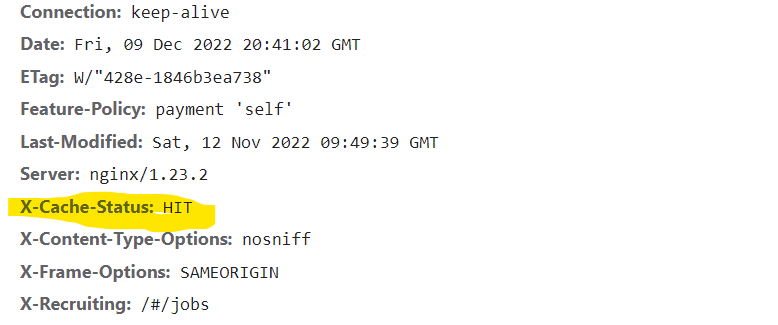
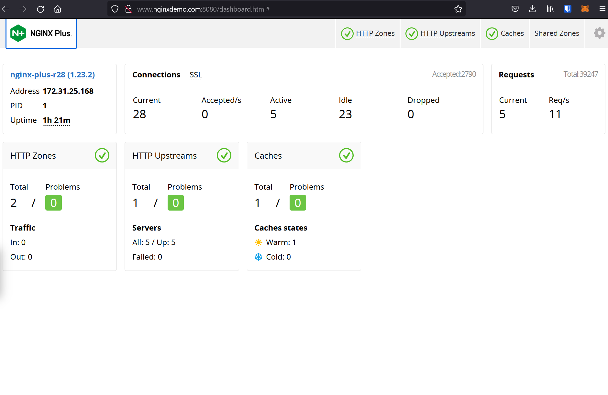
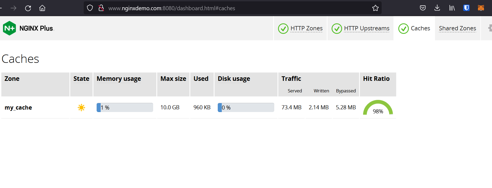

# nginxplus_ecs_cache

This is a set of configs to build a container of Nginx Plus on top of UBI8 along with configs for enabling caching and the Nginx Plus API with the Dashboard. It will require a valid Nginx Plus license (`nginx-repo.crt` and `nginx-repo.key`) to build.

This was tested against a [Juiceshop](https://hub.docker.com/r/bkimminich/juice-shop) app.

The caching config uses the directory /data/cache.

```
proxy_cache_path /data/cache levels=1:2 keys_zone=my_cache:10m max_size=10g 
                 inactive=60m use_temp_path=off;
```

The upstream (pool) is an ECS Service that had the service discovery name hello-service.hello.com. The Route53 resolver is used here also. This config also uses sticky sessions for session persistence.
```
...
resolver 172.31.0.10 valid=10s;

upstream hello-backend {
        zone hello-backend 64k;
        server hello-service.hello.com:3000 resolve;
...
```

Nginx is listening on three ports:
- 80 (HTTP with a redirect to HTTPS)
- 443 (HTTPS)
- 8080 (Nginx Plus API)

The HTTPS server is looking for a certificate and key (`default.crt` and `default.key`)to be located in `/etc/ssl/hello`. 
The cache is enabled for only specific file types and the purge method `PURGE` is also enabled. Tha app that was being cached for testing purposes included a `Cache-Control public, max-age=0` header so that needed to be ignored with the `proxy_ignore_headers Cache-Control` directive.

```
...
    location ~* \.(jpeg|js|jpg|png|css)$ {
        add_header X-Cache-Status $upstream_cache_status;
        proxy_cache_revalidate on;
        proxy_cache_min_uses 3;
        proxy_cache_use_stale error timeout updating http_500 http_502 http_503 http_504;
        proxy_ignore_headers Cache-Control;
        proxy_cache_valid any 30m;
        proxy_cache my_cache;
        proxy_set_header Host $host;
        proxy_pass http://hello-backend;
        proxy_cache_purge $purge_method;
    }
...
```

The cache also adds a header `X-Cache-Status` to show if a request was a cache hit/miss


Since the Juiceshop app utilizes websockets, there was also a section in the config for upgrading the connection to enable the websockets.

```
...
    location /socket.io {
        proxy_http_version 1.1;
        proxy_set_header Upgrade $http_upgrade;
        proxy_set_header Connection "Upgrade";
        proxy_set_header Host $host;
        proxy_pass http://hello-backend;
    }
...
```

Finally, the Nginx Plus API and dashboard are both enabled and running on port 8080. 




